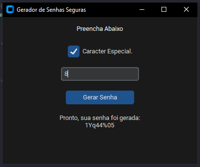

# Gerador de Senhas Seguras em Python

## 📕 Descrição

Este é um **Gerador de Senhas Seguras** desenvolvido em Python utilizando a biblioteca **CustomTkinter** para a interface gráfica. A aplicação permite ao usuário gerar senhas aleatórias e seguras com caracteres especiais, números e letras maiúsculas/minúsculas, conforme o tamanho desejado.

## ⚙️ Funcionalidades

- Geração de senhas seguras com números, letras e caracteres especiais.
- Interface gráfica amigável com CustomTkinter.
- Opção de definir o tamanho da senha (entre 8 e 24 caracteres).
- Validação de tamanho mínimo e máximo da senha.

## 💻 Pré-requisitos

Certifique-se de ter o **Python** e a biblioteca **CustomTkinter** instalados. Você pode instalar usando o seguinte comando:
> [!TIP]
> Instale o ``customtkinter``:
> ~~~
> pip install customtkinter
> ~~~

## 🎮 Como Utilizar

1. Clone o repositório para o seu ambiente local.
2. Navegue até o diretório do projeto.
3. Execute o gerador de senhas com o seguinte comando:
   ~~~
   python main.py
   ~~~
4. Insira o tamanho desejado da senha e clique no botão para gerar a senha.

## 📫 Contribuições

Contribuições são bem-vindas! Se você tiver sugestões ou melhorias, fique à vontade para enviar um pull request.

## 🤝 Autor

- Maycon Vinicius B. Araújo - ``M4ycosoft``

## 🧾 Licença

Este projeto está licenciado sob a Licença MIT.